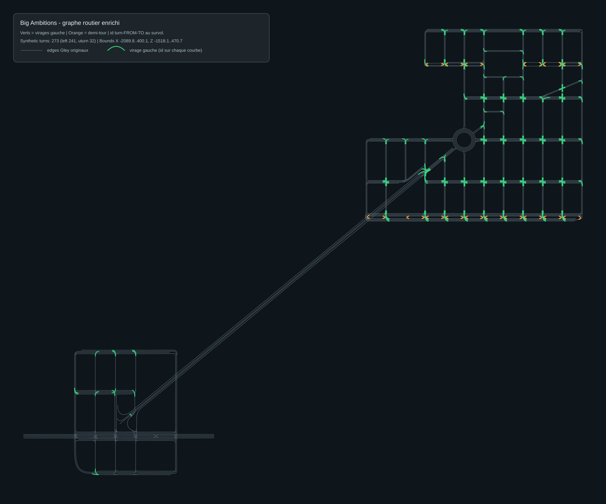

# Voogle Route

**Voogle Route** extends **Voogle Maps** in Big Ambitions: set a destination on the city map, then follow a glowing **on-ground route line** on foot or in a vehicle, with optional **auto-walk**.

| | |
|---|---|
| **Game** | Big Ambitions EA **0.11 Experimental** |
| **Distribution** | **[Steam Workshop](https://steamcommunity.com/app/2977660/workshop/)** — primary install method |
| **Languages** | All **22** Big Ambitions interface languages |
| **Author** | [capisoft-lib](https://github.com/capisoft-lib) — community mod, not affiliated with Hovgaard Games |

## Steam Workshop

Voogle Route is published as a **native Steam Workshop mod** for Big Ambitions EA 0.11.

1. Open the game's **Workshop** browser (or the mod's Steam Workshop page).
2. Click **Subscribe**.
3. Launch Big Ambitions → **Mods** menu → enable **Voogle Route**.
4. In the city, use the **VOOGLE ROUTE** panel (bottom-left) after setting a destination on **Voogle Maps**.

No MelonLoader, no manual DLL copy, no `Mods/` folder. The game downloads and updates the mod like any other Workshop item.

Workshop description copy for each release lives in [`releases/<version>/`](releases/).

## Features

- **Route line on the ground** — neon path to your map destination; separate styling on foot vs. in a vehicle
- **Road-aware driving routes** — vehicle paths follow the city's **Gley traffic waypoint graph**, enriched with synthetic turns (see below)
- **Auto-walk** — walk the route automatically (`WALK ON`); stops if you take manual control
- **VOOGLE ROUTE panel** — bottom-left BizPhone-style UI (`ROUTE ON / ROUTE OFF`)
- **Custom line color** — presets or the in-game color picker (gear icon)
- Hidden in the **subway** and when navigation is unavailable

## Enhanced driving graph

Vanilla **Gley Traffic System** waypoints model forward lane connectivity well, but they do **not** expose every **left turn** or **U-turn** a driver needs at intersections. Voogle Route ships a precomputed graph extension so vehicle routing can turn onto cross streets instead of only going straight.

### Pipeline overview

```
In-game Gley waypoints (CurrentSceneData.allWaypoints)
        │
        ▼  export to CSV (listIndex, name, position, neighbors, …)
        │
        ▼  tools/generate_enhanced_route_graph.py
        │     • keep all base Gley edges (edgeType=base, source=gley)
        │     • detect intersection exits/entries per road lane
        │     • add synthetic_turn / left  (green curves on map)
        │     • add synthetic_turn / uturn (orange curves on map)
        │
        ▼  VoogleRoute/Data/big_ambitions_enhanced_routes.csv
        │
        ▼  at runtime: TrafficWaypointGraph + EnhancedRouteEdges
              merges synthetic edges into the live Gley graph for A*
```

### Step 1 — Extract the base graph

We dump the city's **Gley** `Waypoint[]` graph to a CSV with one row per waypoint:

- `listIndex`, `name`, `posX` / `posY` / `posZ`, `neighbors` (semicolon-separated indices), `disabled`

That CSV is the **raw traffic graph** the game uses for NPC traffic. Connectors (`Connector`, `CConnect`) and disabled nodes are filtered during enhancement.

### Step 2 — Generate synthetic turns

[`tools/generate_enhanced_route_graph.py`](tools/generate_enhanced_route_graph.py) reads the dump and writes:

- `big_ambitions_enhanced_routes.csv` — base edges + synthetic maneuvers
- `big_ambitions_enhanced_route_graph.svg` — visual QA map (see below)

**Left turns (`maneuver=left`)**

- Consider only **leftmost driving lanes** at each road (lane-direction clustering).
- At each intersection **exit** waypoint, pair with nearby **entry** waypoints on other roads.
- Keep candidates where the signed turn angle is **+28° to +142°** (left turn in our coordinate system).
- Skip pairs already reachable through the base graph (short BFS).
- Store a quadratic **control point** (Bezier) for smooth on-ground rendering.

**U-turns (`maneuver=uturn`)**

- **Parallel corridor pairs** (e.g. Roads 10↔11, 47↔48): one authorized ~180° link per intersection station between opposite carriageways.
- **Internal multi-lane roads** (4-lane axes): U-turn from leftmost exit back to leftmost entry on the same road when geometry is ~145°–181°.
- U-turn edges are whitelisted at runtime — generic ~180° turns on the base graph remain blocked.

Manual exclusions (bad auto-detections) are maintained as blocklists in the generator (`EXCLUDED_SYNTHETIC_ROAD_PAIRS`, `EXCLUDED_SYNTHETIC_WAYPOINT_PAIRS`, …). An interactive HTML picker (`*_picker.html`) helps review individual `turn-FROM-TO` curves.

Regenerate after a game update that changes city traffic data:

```bash
python tools/generate_enhanced_route_graph.py <waypoints_dump.csv> VoogleRoute/Data/big_ambitions_enhanced_routes.csv docs/big_ambitions_enhanced_route_graph.svg
```

### Step 3 — Runtime merge

At city load, [`TrafficWaypointGraph`](VoogleRoute/Scripts/Navigation/TrafficWaypointGraph.cs) builds forward edges from live Gley data, then [`EnhancedRouteEdges`](VoogleRoute/Scripts/Navigation/EnhancedRouteEdges.cs) loads `synthetic_turn` rows from the shipped CSV and appends them. U-turn rows also register in `_authorizedUturnEdges` so only those reversals are allowed during pathfinding.

### Map visualization

Grey polylines = original **Gley** edges. Green curves = **left turns**. Orange curves = **U-turns**. Hover IDs follow `turn-<fromIndex>-<toIndex>`.



## Repository layout

```
VoogleRoute/              ← mod sources (drop into SDK Assets/Mods/VoogleRoute/)
  PathFinding/            ← git submodule → BigAmbitions_VoogleRoute.PathFinding
  Dependencies/           ← VoogleRoute.Pathfinding.dll + System.Text.Json
  Scripts/
  Locales/
  Data/                   ← big_ambitions_enhanced_routes.csv
  tools/build-pathfinding.ps1
docs/                     ← route graph SVG, publishing notes
releases/                 ← Steam Workshop copy per version
tools/                    ← locale + graph generators
legacy/                   ← MelonLoader 0.10 archive pointer
```

## Development

Requires the [Big Ambitions Modding SDK](https://github.com/HovgaardGames/BigAmbitionsModding) (Unity **2022.3.62f2**), [`LIB_BaPlayerLocation`](https://github.com/capisoft-lib/BigAmbitions_LIB_BaPlayerLocation), and a local game install for imported assemblies.

1. Clone with submodules:

   ```bash
   git clone --recurse-submodules https://github.com/capisoft-lib/BigAmbitions_VoogleRoute.git
   ```

2. Copy or symlink `VoogleRoute/` into your SDK at `Assets/Mods/VoogleRoute/` (and install `LIB_BaPlayerLocation` the same way).
3. Build the pathfinding DLL:

   ```powershell
   cd VoogleRoute
   .\tools\build-pathfinding.ps1
   ```

4. Import game DLLs via the SDK setup flow.
5. **Mod Builder → Build + Install** for `LIB_BaPlayerLocation`, then `VoogleRoute`.

Output installs to:

`%LocalLow%\Hovgaard Games\Big Ambitions\ModsLocal\VoogleRoute\`

## Migrating from MelonLoader (0.10)

The MelonLoader builds (`v0.10.0`, `v0.10.1`) are **legacy**. Remove MelonLoader and `VoogleRoute.dll` from `Big Ambitions/Mods/`, then subscribe on Workshop for 0.11. See [legacy/README.md](legacy/README.md).

## Changelog

See [CHANGELOG.md](CHANGELOG.md).

## Licence

See [LICENSE](LICENSE).

---

# Voogle Route (français)

Mod **Steam Workshop** pour Big Ambitions EA **0.11 Experimental** : ligne d'itinéraire au sol, marche auto et couleur personnalisable pour les destinations **Voogle Maps**.

### Installation

1. **S'abonner** sur Steam Workshop  
2. Activer **Voogle Route** dans le menu **Mods**  
3. Définir une destination sur Voogle Maps → panneau **VOOGLE ROUTE**

### Graphe routier enrichi

1. **Extraction** — export CSV des waypoints **Gley** (`CurrentSceneData.allWaypoints`)  
2. **Enrichissement** — `tools/generate_enhanced_route_graph.py` ajoute les virages **gauche** (verts) et **demi-tours** (orange) manquants  
3. **Livraison** — `VoogleRoute/Data/big_ambitions_enhanced_routes.csv`  
4. **Runtime** — fusion dans `TrafficWaypointGraph` pour le routage véhicule

Carte SVG : [docs/big_ambitions_enhanced_route_graph.svg](docs/big_ambitions_enhanced_route_graph.svg)

Les builds MelonLoader 0.10 sont archivés : [legacy/README.md](legacy/README.md).
